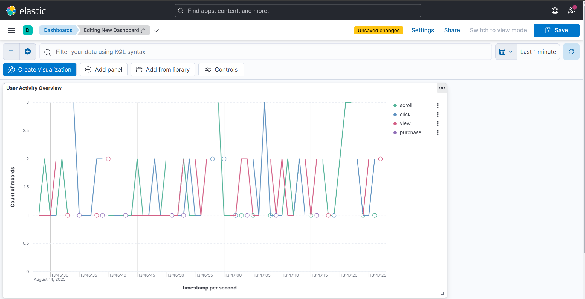

# Real-Time User Activity Tracker

A real-time data pipeline that captures, processes, and visualizes user activity events using **Spring Boot**, **Apache Kafka**, and **Elasticsearch**.

## 🚀 Architecture Overview

```
Web Client → REST API → Kafka → Consumer → Elasticsearch → Kibana Dashboard
```

- **Producer**: Spring Boot REST API captures user events (clicks, page views, etc.)
- **Message Broker**: Kafka handles real-time event streaming
- **Consumer**: Spring Boot service processes events and stores in Elasticsearch
- **Visualization**: Kibana dashboards for real-time analytics

## 🛠️ Tech Stack

- **Backend**: Spring Boot 3.x, Java 17
- **Message Streaming**: Apache Kafka (KRaft mode)
- **Search & Analytics**: Elasticsearch 8.x
- **Data Visualization**: Kibana/OpenSearch Dashboards
- **Containerization**: Docker Compose
- **Build Tool**: Maven

## 📦 Project Structure

```
.
├── README.md
├── kafka-infrastructure/
│   └── docker-compose.yaml
└── user-activity-tracker/
    ├── pom.xml
    ├── src/
    │   ├── main/
    │   │   ├── java/com/malik/streams/user_activity_tracker/
    │   │   │   ├── UserActivityTrackerApplication.java
    │   │   │   ├── config/
    │   │   │   │   ├── ElasticsearchConfig.java
    │   │   │   │   ├── JacksonConfig.java
    │   │   │   │   ├── KafkaConsumerConfig.java
    │   │   │   │   └── KafkaProducerConfig.java
    │   │   │   ├── controller/
    │   │   │   │   └── UserActivityController.java
    │   │   │   ├── listener/
    │   │   │   │   └── UserActivityListener.java
    │   │   │   └── model/
    │   │   │       └── UserActivityEvent.java
    │   │   └── resources/
    │   │       └── application.properties
    │   └── test/
    └── target/
```

## 🚦 Quick Start

### 1. Prerequisites
- Java 17+
- Maven 3.6+
- Docker & Docker Compose

### 2. Start Infrastructure
```bash
# Navigate to infrastructure directory
cd kafka-infrastructure

# Start Kafka, Elasticsearch, and Kibana
docker-compose up -d

# Verify services are running
docker-compose ps
```

### 3. Run the Application
```bash
# Navigate to Spring Boot project
cd user-activity-tracker

# Start the Spring Boot application
./mvnw spring-boot:run
```

### 4. Test the Pipeline

**Send a user activity event:**
```bash
curl -X POST http://localhost:8081/api/activity/track \
  -H "Content-Type: application/json" \
  -d '{
    "userId": "user123",
    "eventType": "CLICK", 
    "page": "/home",
    "elementId": "buy-button",
    "sessionId": "session456"
  }'
```

**Verify data in Elasticsearch:**
```bash
curl -X GET "localhost:9200/user-activity/_search?pretty"
```

## 🔧 Configuration

### Kafka Topics
- `user-activity` - Raw user events
- `user-activity-processed` - Processed events (future use)

### Elasticsearch Index
- `user-activity` - Stores all user activity events with timestamp, user info, and event metadata

### Environment Variables
```properties
spring.kafka.bootstrap-servers=localhost:9092
spring.kafka.consumer.group-id=primary-group
elasticsearch.host=localhost
elasticsearch.port=9200
```

## 📊 Available Endpoints

| Method | Endpoint | Description |
|--------|----------|-------------|
| POST | `/api/activity/track` | Track generic user activity |
| POST | `/api/activity/track/click` | Track button/element clicks |
| POST | `/api/activity/track/view` | Track page views |

## 🐳 Docker Services

| Service | Port | Purpose |
|---------|------|---------|
| Kafka | 9092 | Message broker |
| Kafka UI | 9091 | Topic management interface |
| Elasticsearch | 9200 | Search and analytics engine |
| Kibana | 5601 | Data visualization dashboard |

## 📈 Monitoring & Visualization

Access the dashboards:
- **Kafka UI**: http://localhost:9091 - Monitor topics and messages
- **Elasticsearch**: http://localhost:9200 - Query data directly
- **Kibana**: http://localhost:5601 - Create visualizations and dashboards

## Dashboards
Below is a sample dashboard of the user event data in Kibana.

## 🔍 Sample Queries

**Get all events for a user:**
```bash
curl -X GET "localhost:9200/user-activity/_search" \
  -H "Content-Type: application/json" \
  -d '{"query": {"match": {"userId": "user123"}}}'
```

**Get events by type:**
```bash
curl -X GET "localhost:9200/user-activity/_search" \
  -H "Content-Type: application/json" \
  -d '{"query": {"match": {"eventType": "CLICK"}}}'
```

## 🚀 Future Enhancements

- [ ] Automated Elasticsearch index management service
- [ ] Real-time alerting for unusual activity patterns
- [ ] A/B testing framework integration
- [ ] Machine learning for user behavior prediction
- [ ] Stream processing with Kafka Streams
- [ ] Multi-tenant support
- [ ] Performance metrics and monitoring

## 🏗️ Development

**Build the project:**
```bash
cd user-activity-tracker
./mvnw clean compile
```

**Run tests:**
```bash
./mvnw test
```

**Package application:**
```bash
./mvnw package
```

## 📝 Event Schema

```json
{
  "userId": "string",
  "eventType": "string", 
  "timestamp": "2025-08-13T12:34:56.789",
  "page": "string",
  "elementId": "string",
  "sessionId": "string",
  "userAgent": "string",
  "ipAddress": "string"
}
```

## 🤝 Contributing

1. Fork the repository
2. Create a feature branch (`git checkout -b feature/amazing-feature`)
3. Commit your changes (`git commit -m 'Add amazing feature'`)
4. Push to the branch (`git push origin feature/amazing-feature`)
5. Open a Pull Request

## 📄 License

This project is for portfolio demonstration purposes.
---

**Built by Malik Green** | [LinkedIn](https://linkedin.com/in/malik-green) | [GitHub](https://github.com/MalikCoderGreen)